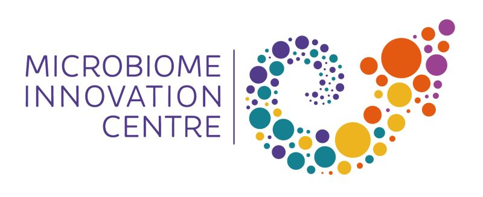

--- 
title: "Shotgun Metagenomics resources"
author: "Sam Haldenby and Matthew R. Gemmell"
date: "`r Sys.Date()`"
site: bookdown::bookdown_site
output: bookdown::gitbook
documentclass: book
bibliography: [book.bib, packages.bib]
biblio-style: apalike
link-citations: yes
favicon: figures/NEOF_favicon.png
description: MIC/CGR book for the Microbial shotgun metagenomics workshop resources
cover-image: "figures/NEOF.png"
---

<center>
{style="width:400px; border-radius:5px; border: 5px white solid"}
</center>

<center>
{style="width:400px; border-radius:5px"}
</center>

# Videos, slides, & files

```{r, fig.align = 'center',out.width= '20%', echo=FALSE }
knitr::include_graphics(path = "figures/squid.png", auto_pdf = TRUE)
``` 

## Introduction

<div class="container">
<iframe src="https://www.youtube.com/embed/471qtCWfL-o" 
frameborder="0" allowfullscreen class="video"></iframe>
</div>

[__Slides__](https://docs.google.com/presentation/d/1kTof6vvsFiA7zRDbY6n6Jd4SvnxO_4L0wgfS518iyNA/edit?usp=sharing)

## Kraken 2

<div class="container">
<iframe src="https://www.youtube.com/embed/AEuuGY7OFaI" 
frameborder="0" allowfullscreen class="video"></iframe>
</div>

[__Slides__](https://docs.google.com/presentation/d/1iYj_-vdSDK4y_nQf2Fv0aNRA0vfCAW9buoSSb_BPAcQ/edit?usp=sharing)

## HUMAnN & bioBakery

[__Slides__](https://docs.google.com/presentation/d/1DWh82hNgzl0Hu6NgfyADmRmxyBLTO_8hYLC3ySwxHkk/edit?usp=sharing)

## Assembly approach

[__Slides__](https://docs.google.com/presentation/d/1zN7aHaRk_cZkmBXva01RFfjRV3wGTzBEudGuce8c9Z4/edit?usp=sharing)

## Bookdown html

Links to the online version of the Bookdown.

- [__Main__](https://cgr-liverpool.github.io/Shotgun_metagenomics_kf97dx/maid_course/)
